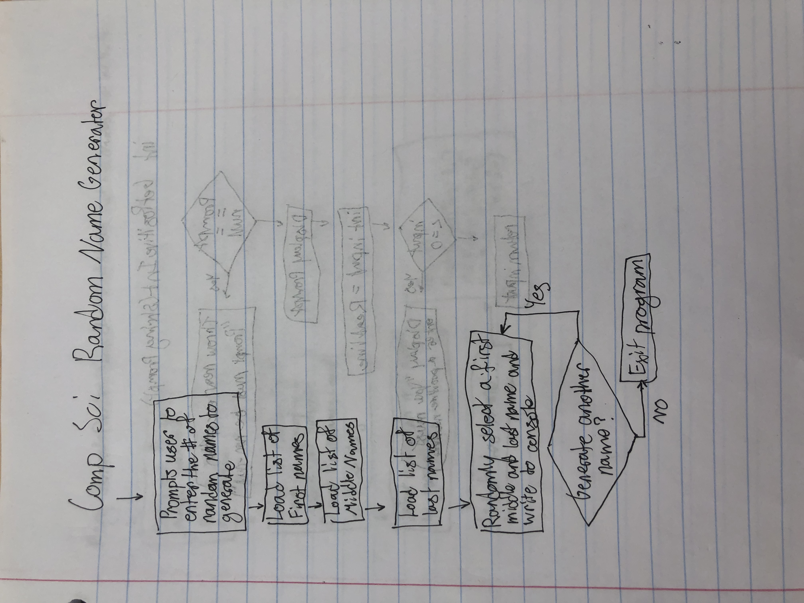
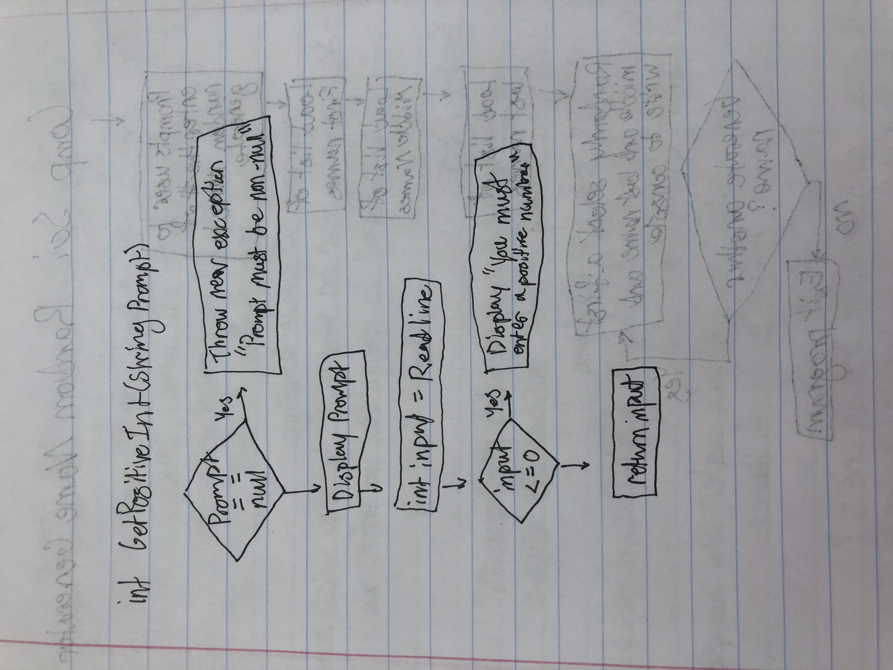
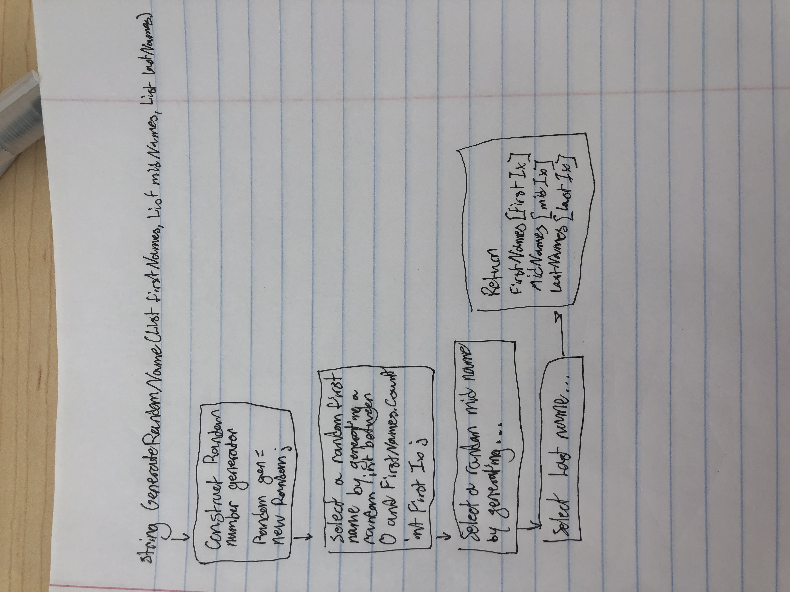

# RandomNameGenerator

Overview:

The purpose of Random Name Generator is to provide entertainment to the user by generating funny names. It accepts input from the user by letting them specify the number of names they want to generate. After accepting the number of names to generate, the program writes a list of random names to the console.

Flowcharts:

Main:
Prompts the user to enter the number of random names to generate
Loads a list of possible first names
Loads a list of possible middle names
Loads a list of possible last names
Randomly selects a first, middle, and last name
Writes the randomly generated name to the console
If more names need to be generated, go to step 5
Otherwise, the program exits

GetPositiveInt:

Given a prompt to show to the user, displays the prompt then reads input from the keyboard until the user enters a positive number. If the user enters a non-positive number, this method displays an error message and prompts the user again.
Validate the prompt is a string
Display the prompt
Read input from the user
If the user entered a non-positive number,
Display an error message
Go to step 2
Otherwise, return the users input

GenerateRandomName:

Given a list of first, middle, and last names, generate a random name using one entry from each list.
Create a random number generator
Generate a random number, firstIndex, between 0 and firstNames.Count
Generate a random number, midIndex, between 0 and midNames.Count
Generate a random number, lastIndex, between 0 and lastNames.Count
Combine the names together
firstNames[firstIndex] + " " + midNames[midIndex] + " " + lastNames[lastIndex];
Return the name